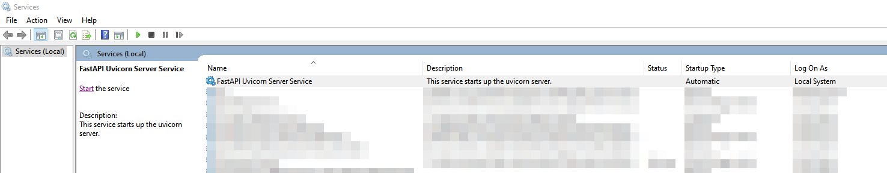
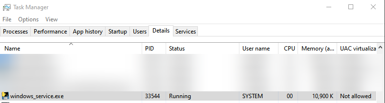
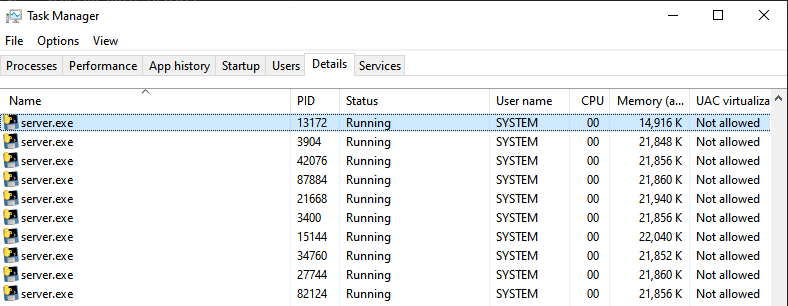
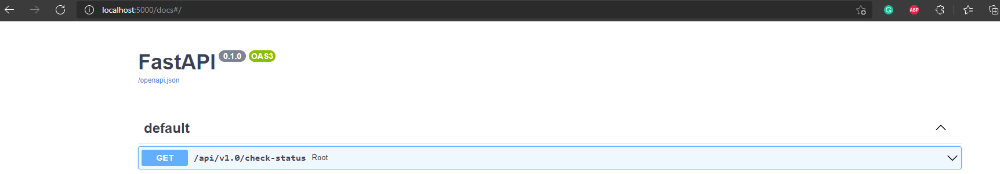
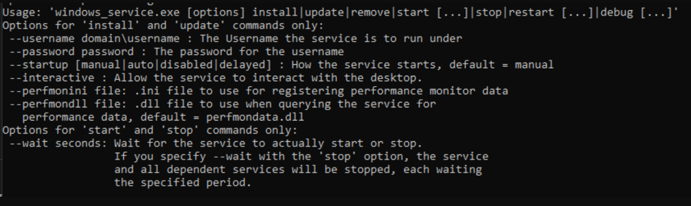

This repository is for creating a FastAPI/Uvicorn windows service.

Note: You need Miniconda3 or Anaconda3 installed on your system.

---
## Steps for building the service
1. From the root repo directory run create_windows_service_installer.bat

## Steps for installing the service
1. Move dist/clamdapiserver.exe and dist/clamav_webapi_windows_service to C:\Program Files\ClamAV
2. Open elevated command prompt (i.e. as Admin)
3. cd to C:\Program Files\ClamAV
4. `call clamav_webapi_windows_service.exe --startup auto install`
5. `call clamav_webapi_windows_service.exe start`

The service will be installed on your system in auto run mode.

You can start, stop, restart the service manually from the Services window.

Your service will be visible in the Task Manager details tab.

The Uvicorn server would be available at localhost:5000. 

You can check the API swagger at localhost:5000/docs.

The available CLI options for the windows service executable are shown below.

## Debugging

If for some reason you want to debug the server follow these steps:
1. Stop the FastAPI windows service
2. Run dist/clamavapiserver.exe

You will be able to see logging values in the command prompt.

Logs are available at C:\Program Files\ClamAV in the following files
clamapi.log
clamav_api_windows_service.log
clamavapiserver.log

These files correspond with their .py equivalents

## Uninstallation/Environment Reset

delete /build and /dist

sc.exe delete "ClamAV Web API Server Service"

## API Documentation

### Request

Post to the server IP address on port 5000
Open the file (example in this case is going to be loaded into a variable named file_1)
and form the post body as the following
{'file': file_1}

The POST body would end up containing the file in the follwoing format:

...,
files": {
    "file": "<censored...binary...data>"
},
...

### Response

`{'result': {'OK': None}}`
This scan result shows that the supplied file was clean from any known threats

`{'result': {'FOUND': 'Win.Test.EICAR_HDB-1'}}`
This scan result shows that a known threat was found. The type of threeat can be ignored. the 'FOUND' parameter is what should be looked at.
Files which return this result should be immediately rejected and discarded

`{'result': {'ERROR': "Can't open file or directory"}}`
The above response is the result of another virus protection program quarantining the file that was saved for scanning

